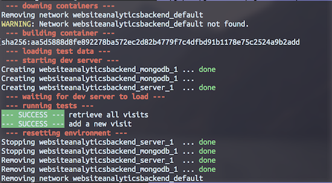

# websiteAnalytics-backend

A RESTful Go backend to track website visits. Each website visit contains a) the ip address of the user b) geographical information about that ip address (i.e. lat-lon, city, zipcode) and c) the date the user visited the website. The stack consists of a Go app served via Docker, backed by a [mongo db](www.mongodb.com) database.

# Routes

### /visits
| Endpoint        | Method         | Description |
| :------------- | :-------------| :--------------------- |
| /visits        | POST         | Adds a new visit        |

The body of the request should have two parameters, `IpAddress` and `Location`, both as strings. There is no specific JSON structure assigned, which adds added flexibility for different use cases. For example, in one project I could write location as simply a city name i.e. 'Minneapolis' and in another I can strinify a bunch of JSON.

Example Request:
```sh
curl -H \
 "Content-Type: application/json" \
 -X POST -d '{
    "ip": "37.142.42.64",
    "city": "Tel Aviv",
    "country_code": "IL",
    "country_name": "Israel",
    "latitude": 32.06660079956055,
    "longitude": 34.76499938964844,
    "metro_code": 0,
    "region_code": "TA",
    "time_zone": "Asia/Jerusalem",
    "zip_code": ""
  }' \
 "http://localhost:5000/visits"

{"totalDocs":2,"visit":{"href":"","ip":"37.142.42.64","city":"Tel Aviv","country_code":"IL","country_name":"Israel","latitude":32.06660079956055,"longitude":34.76499938964844,"metro_code":0,"region_code":"TA","time_zone":"Asia/Jerusalem","zip_code":"","visit_date":"2021-06-03T14:42:10.652474-05:00"}}%
```

### /visits

| Endpoint        | Method         | Description           |
| :------------- | :-------------| :---------------------  |
| /visits      | GET             | Lists all visits        |

Gets all visits, filterable by the following query strings:

| Query String        | Example         | Description           |
| :------------- | :-------------| :---------------------  |
| ip      | /visits?ip=96.83.122.145             | List all visits of a specific ip        |
| city      | /visits?city=Brooklyn             | List all visits of a specific city (case sensitive)        |
| country_code      | /visits?country_code=US             | Lists all visits of a ISO-Alpha2 country code. See [list of country codes](http://www.nationsonline.org/oneworld/country_code_list.htm)       |
| country_name      | /visits?country_name=Israel             | Lists all visits from a specific country       |
| latitude      | /visits?latitude=38.818599700927734             | Lists all visits of a specific latitude        |
| longitude      | /visits?longitude=-77.0625             | Lists all visits  of a specific longitude      |
| metro_code      | /visits?metro_code=511             | Lists all visits by metro code (US only). See [list of metro codes](https://www2.census.gov/programs-surveys/cps/methodology/Geographic%20Coding%20-%20Metro%20Areas%20(since%20August%202005).pdf)       |
| region_code      | /visits?region_code=VA             | Lists all visits by region (usually states in the US or city outside of US)        |
| time_zone      | /visits?time_zone="America/New_York"             | Lists all visits by time zone. See [time zone list](https://timezonedb.com/time-zones)        |
| zip_code      | /visits?zip_code=22301            | Lists all visits by zip code       |
| query_tpe      | /visits?query_type='nor'    | Specifcies the logic type to filter by. Supported are 'and', 'or', 'nor', defaulting to 'and'        |

Sample Query

```
# query for anything which has both country code in US and latitude = 35 or neither
curl "${dev endpoint}/visits?country_code=US&latitude=35&query_type=nor"
# Respose
[
  {
    "ip": "37.142.42.64",
    "city": "Tel Aviv",
    "country_code": "IL",
    "country_name": "Israel",
    "latitude": 32.06660079956055,
    "longitude": 34.76499938964844,
    "metro_code": 0,
    "region_code": "TA",
    "time_zone": "Asia/Jerusalem",
    "zip_code": "",
    "visit_date": "2018-01-25T16:48:44.192Z"
  }
]
```


# Development

### Setup

1. Download the project using go

```sh
# download src
cd $GOPATH/src
go get github.com/dgoldstein1/websiteAnalytics-backend
# cd into directory
cd $GOPATH/src/github.com/dgoldstein1/websiteAnalytics-backend
# install dependencies
govendor install
```

2. Launch Using Docker
 
```
docker-compose up -d
```

The app should now be running on http://localhost:5000. Running `curl http://localhost:5000/visits` should give you `[]` as there are no current visits in the mongo db.

### Testing

```sh
sudo test/run_tests.sh 5000 
# 5000 is the server port, tells the tests where to make their requests
```

You should see the containers reload, and the result of the tests:


### Deployment

This project is continuously deployed with every push or merge to `master` via CircleCI, which builds and pushes the Docker image to Docker Hub.

## Background Lookup

If `BACKGROUND_LOOKUP_ENABLED=true` then a background thread will attempt to lookup any entries using https://ipstack.com/documentation where `longitude` and `latitude` are `0`. Lookups are done on an interval `BACKGROUND_LOOKUP_INTERVAL`

If a lookup fails then `latitude` and `longitude` will be set to `-1`. 

## Authors

* **David Goldstein** - [DavidCharlesGoldstein.com](http://www.davidcharlesgoldstein.com/?github-website-analytics-backend) - [Decipher Technology Studios](http://deciphernow.com/)

## License

This project is licensed under the MIT License - see the [LICENSE.md](LICENSE.md) file for details
